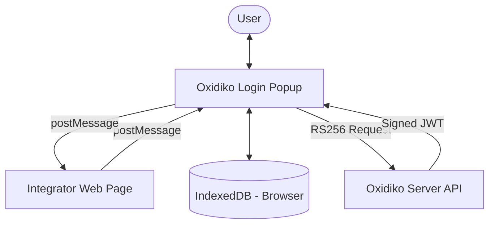
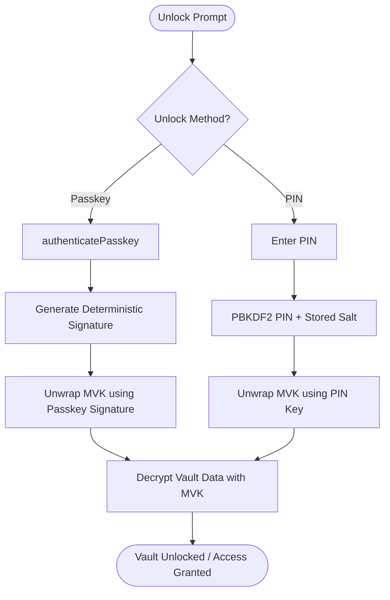

# Oxidiko Security Architecture & Workflows

Oxidiko is a privacy-first, local-first authentication vault. This document outlines the core technical processes that power its security model.

## 1. High-Level Architecture

Oxidiko operates entirely in the browser using the Web Crypto API and IndexedDB. No sensitive data is transmitted to the server unencrypted.

---

## 2. Vault Creation Flow

When a user creates a profile, the Master Vault Key (MVK) is generated and "dual-wrapped" to ensure it can be recovered with either a Passkey or a PIN.

```mermaid
sequenceDiagram
    participant U as User
    participant V as profile-setup.tsx
    participant W as webauthn-utils.ts
    participant S as vault-storage.ts
    participant DB as IndexedDB

    U->>V: Enter Profile Data
    U->>V: Enter Backup PIN
    V->>W: createPasskey()
    W->>U: WebAuthn Prompt
    U->>W: Authn Success
    W-->>V: credId, signature (SHA-256)
    
    V->>S: createVault(profile, oxidikoId, credId, pin, signature)
    
    rect rgb(30, 30, 40)
        Note over S: Key Generation & Wrapping
        S->>S: Generate Master Vault Key (MVK - AES-GCM 256)
        S->>S: Derive PIN Key (PBKDF2 600k iterations)
        S->>S: Derive Passkey Key (from signature)
        S->>S: Wrap MVK with PIN Key -> WrappedKey_PIN
        S->>S: Wrap MVK with Passkey Key -> WrappedKey_Passkey
    end

    S->>S: Encrypt Profile with MVK
    S->>DB: Store encrypted_profile, Wrapped Keys, Salt, IVs
    S-->>V: Success
    V->>U: Vault Created!
```

---

## 3. Unlock Flow (Dual-Lock)

The vault can be unlocked by either the Passkey (biometrics/hardware) or the backup PIN. Both paths lead to the retrieval of the same Master Vault Key (MVK).

---

## 4. Login & Authentication Flow (External Integration)

Oxidiko uses a secure popup-based communication protocol to share specific claims with third-party websites without exposing the Master Vault Key.

```mermaid
sequenceDiagram
    participant Site as External Website
    participant Pop as Oxidiko Popup
    participant S as Oxidiko Server
    participant DB as IndexedDB

    Site->>Pop: window.open('/login')
    Pop-->>Site: postMessage({ oxidikoReady: true })
    Site->>Pop: postMessage({ api_key, fields, site_url })

    Pop->>S: POST /api/api-keys (Validate Key)
    S-->>Pop: OK (Quota/Name)
    
    Pop->>Pop: Show Requested Fields to User
    
    Note over Pop: User selects Passkey or PIN
    Pop->>DB: Fetch Wrapped Keys
    Pop->>Pop: Unlock Vault (MVK)
    
    Pop->>Pop: Filter Profile Claims (Name, Email, etc.)
    
    Pop->>Pop: User Clicks "Allow"
    
    rect rgb(30, 40, 30)
        Note over Pop: Per-Site Encryption (Isolation)
        Pop->>DB: Fetch Wrapped Site Key
        alt Key exists
            Pop->>Pop: Unwrap Site Key using MVK
        else New Site
            Pop->>Pop: Generate 128-bit Random Seed
            Pop->>Pop: HKDF(Seed, Salt: Origin, Info: "oxidiko-site-key")
            Pop->>Pop: Store Wrapped Site Key (AES-GCM/MVK)
        end
        Pop->>Pop: Encrypt Data with Site Key
    end
    
    Pop->>S: POST /api/generate-jwt (Encrypted Data)
    S->>S: Sign with RSA Private Key
    S-->>Pop: signed_token (JWT)
    
    Pop->>Site: postMessage({ type: 'OXID_AUTH_SUCCESS', token })
    Pop->>Pop: window.close()
    
    Site->>Site: Send token to Backend
    Site->>S: [Optional] POST /api/verify-jwt
```

---

## 5. Security Summary

| Feature | Implementation | Purpose |
| :--- | :--- | :--- |
| **Local-first** | All data stored in `IndexedDB`. | User owns their data; no cloud breaches. |
| **Master Key (MVK)** | AES-GCM 256-bit. | Standard high-security symmetric encryption. |
| **Dual-Wrapping** | PIN (PBKDF2) OR Passkey (WebAuthn). | Flexibility without compromising security. |
| **Per-site Isolation** | Unique keys generated from true entropy (128-bit random seed), mixed with origin salt via HKDF, and stored wrapped by MVK. | Prevents site-key predictability; ensures data for one site cannot be decrypted using another site's key even if the MVK is compromised (requires local DB access + MVK). |
| **Zero-Knowledge** | Server only signs already-encrypted blobs. | Oxidiko operators cannot read user profiles. |
| **RS256 JWT** | Server-side signing. | Trusted proof of identity for external integrators. |
